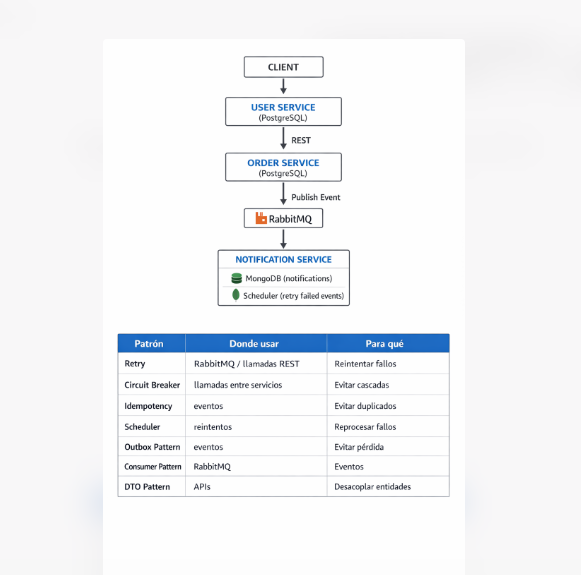
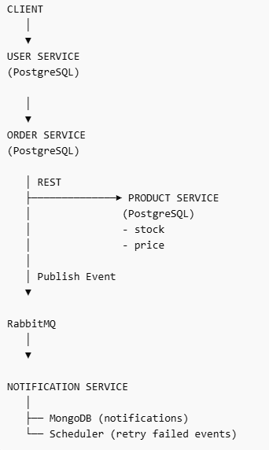

# 🏗️ Architecture Overview

## 📊 System Diagram

---

## 🧠 Description

Este sistema está basado en una arquitectura de microservicios orientada a eventos.

### Servicios principales:

- **USER SERVICE**
  - Autenticación y gestión de usuarios
  - Base de datos: PostgreSQL

- **PRODUCT SERVICE**
  - Gestión de productos, precios y stock
  - Base de datos: PostgreSQL

- **ORDER SERVICE**
  - Orquestación de órdenes
  - Valida productos y publica eventos
  - Base de datos: PostgreSQL

- **NOTIFICATION SERVICE**
  - Consume eventos y genera notificaciones
  - Base de datos: MongoDB
  - Incluye scheduler para reintentos

- **RABBITMQ**
  - Comunicación asíncrona entre servicios

---

## ⚙️ Arquitectura

- Comunicación síncrona: REST
- Comunicación asíncrona: RabbitMQ
- Servicios desacoplados