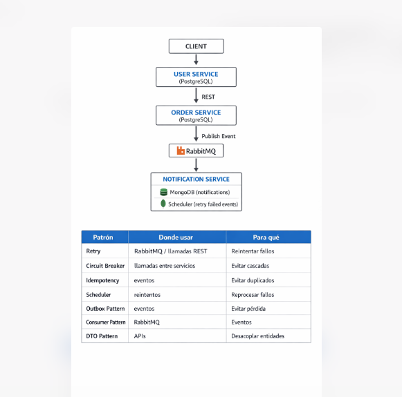
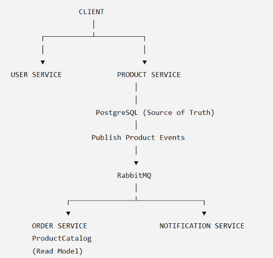

# Architecture Overview

## Objetivo

Este documento presenta una visión general de la arquitectura del proyecto **Ecommerce Microservices Demo**.

Su propósito es explicar cómo está organizado el ecosistema, cómo interactúan los microservicios y cuáles son los principios arquitectónicos que guiaron el diseño del sistema.

La documentación específica de cada servicio se encuentra en `docs/services`.

---

# Arquitectura General

## Diagrama del Sistema





---

# Visión del Ecosistema

El proyecto implementa una arquitectura de microservicios donde cada servicio representa un dominio de negocio independiente.

Cada microservicio posee:

- Responsabilidad única.
- Base de datos propia.
- Lógica de negocio independiente.
- API desacoplada.
- Capacidad de evolucionar de manera autónoma.

La comunicación entre servicios combina mecanismos síncronos y asíncronos para equilibrar simplicidad, rendimiento y desacoplamiento.

---

# Dominios del Sistema

Actualmente el ecosistema está compuesto por los siguientes dominios.

| Servicio | Dominio | Responsabilidad |
|----------|----------|----------------|
| User Service | Identity | Autenticación y autorización. |
| Product Service | Catalog | Gestión del catálogo de productos. |
| Order Service | Orders | Gestión del ciclo de vida de las órdenes. |
| Notification Service | Notifications | Envío de notificaciones del sistema. |
| Common Library | Shared Infrastructure | Componentes reutilizables para todo el ecosistema. |

Cada dominio evoluciona de forma independiente respetando contratos bien definidos.

---

# Modelo de Comunicación

La arquitectura utiliza dos estilos de comunicación.

## Comunicación Síncrona

REST

Se utiliza cuando un servicio necesita obtener una respuesta inmediata.

Ejemplos:

- Registro de usuarios.
- Inicio de sesión.
- Consultas realizadas por el cliente.

---

## Comunicación Asíncrona

RabbitMQ

Se utiliza para propagar cambios del dominio sin generar dependencias directas entre productores y consumidores.

Ejemplos:

- PRODUCT_CREATED
- PRODUCT_UPDATED
- PRODUCT_ACTIVATED
- PRODUCT_DEACTIVATED
- PRODUCT_STOCK_UPDATED

La comunicación mediante eventos favorece una arquitectura desacoplada y escalable.

---

# Persistencia

Cada microservicio administra su propia base de datos.

```text
User Service
    │
PostgreSQL

Product Service
    │
PostgreSQL

Order Service
    │
PostgreSQL

Notification Service
    │
MongoDB
```

No existe acceso directo entre bases de datos.

La información compartida se obtiene mediante APIs o eventos.

---

# Principios Arquitectónicos

La arquitectura del proyecto se basa en los siguientes principios.

## Domain-Driven Design (DDD)

Cada microservicio es dueño de su propio dominio y de sus reglas de negocio.

---

## Database per Service

Cada servicio administra su propia persistencia.

Esto reduce el acoplamiento y favorece la independencia entre dominios.

---

## Event-Driven Architecture (EDA)

Los cambios relevantes del dominio se comunican mediante eventos publicados en RabbitMQ.

Los productores desconocen qué servicios consumirán dichos eventos.

---

## Eventual Consistency

Los servicios mantienen proyecciones locales sincronizadas mediante eventos.

Esto permite reducir dependencias síncronas sin perder consistencia funcional.

---

## Single Source of Truth

Cada dominio posee una única fuente oficial de información.

Ejemplos:

- User Service → Identidad.
- Product Service → Catálogo.
- Order Service → Órdenes.

---

## Bajo Acoplamiento

Los servicios interactúan mediante contratos.

Nunca acceden directamente a la implementación interna de otros dominios.

---

# Estado Actual

Actualmente el proyecto implementa:

- Arquitectura basada en microservicios.
- Autenticación mediante JWT.
- Spring Security.
- Product Service como Single Source of Truth del catálogo.
- Arquitectura Event-Driven utilizando RabbitMQ.
- ProductCatalog como proyección local en Order Service.
- Logging estructurado.
- TraceId distribuido.
- Documentación estandarizada por servicio.

---

# Evolución

La arquitectura continuará evolucionando incorporando nuevas capacidades.

Entre ellas:

- Inventory Service.
- Payment Service.
- Saga Pattern.
- Outbox Pattern.
- Publisher Confirms.
- Dead Letter Queue (DLQ).
- Retry.
- OpenTelemetry.
- Observabilidad distribuida.

Los detalles de estas evoluciones se documentan en los Roadmaps de cada servicio y en los documentos específicos de arquitectura.

---

# Documentación Relacionada

La documentación de arquitectura se complementa con:

- flow.md
- rabbitmq.md
- event-model.md
- distributed-tracing.md
- logging.md
- security.md
- common-library.md
- projections.md

La documentación funcional de cada dominio se encuentra en:

```
docs/services/
```